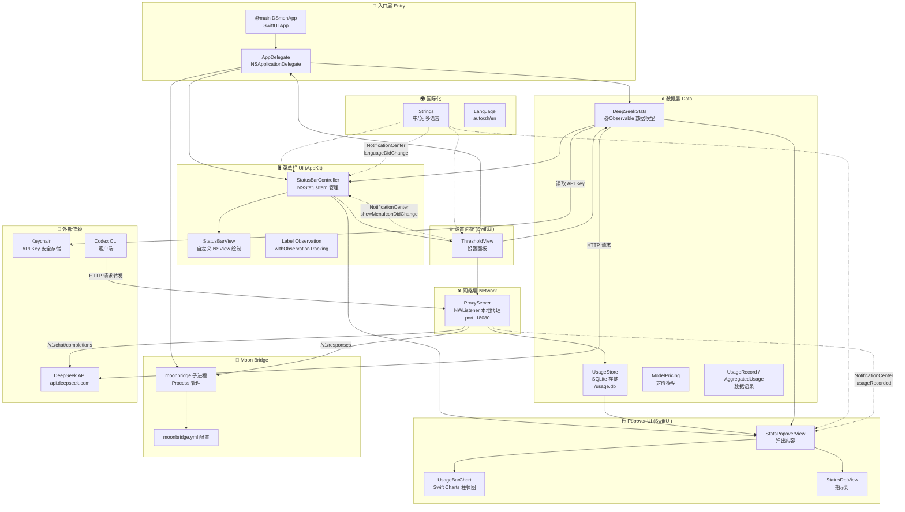
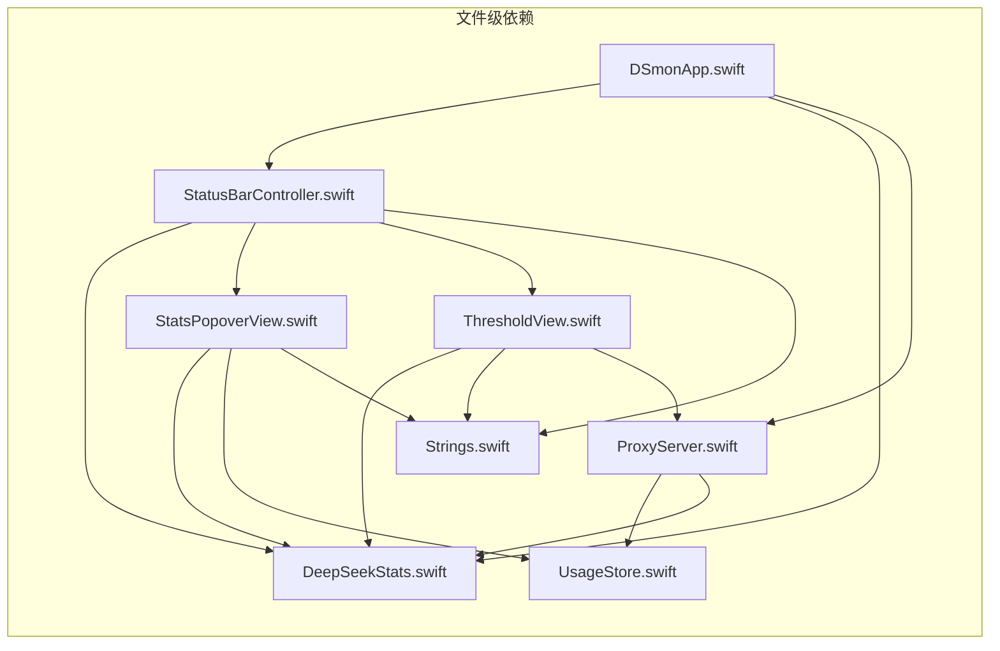
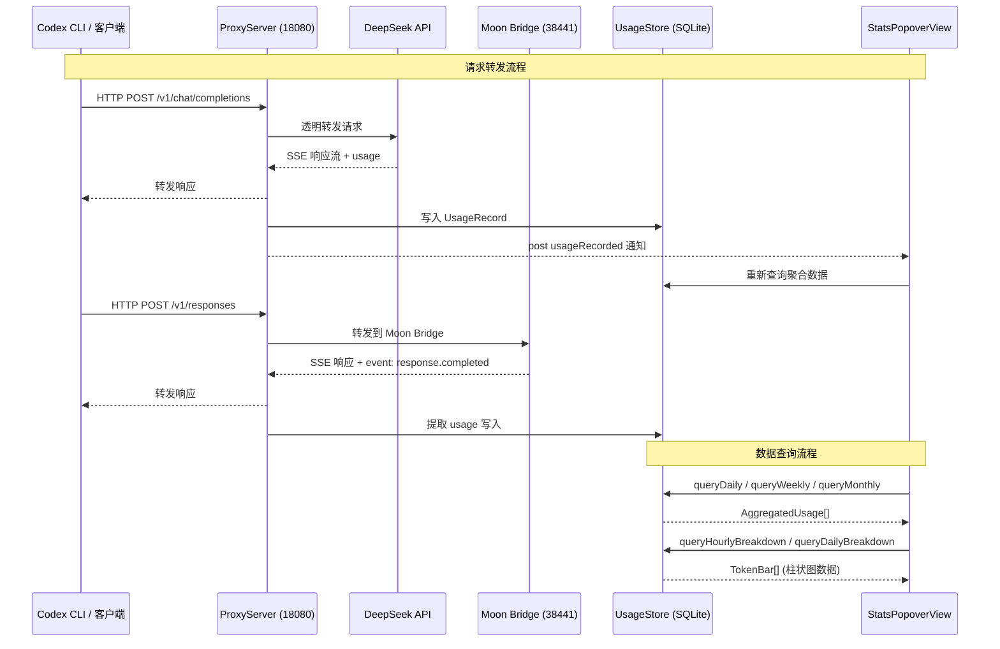

# DS-mon 架构图

## 整体架构

## 模块依赖关系

## 数据流

## 关键设计说明

| 关注点 | 方案 |
|--------|------|
| **余额监控** | 每 60s 自动轮询 DeepSeek API，余额低于阈值时菜单栏红色闪烁 |
| **API Key 安全** | 通过 macOS Keychain（Security Framework）存储 |
| **用量统计** | 本地 HTTP 代理透明拦截 + 解析 SSE 流中的 usage 数据 |
| **持久化** | SQLite (WAL 模式)，存储 usage 记录并支持按小时/天/周聚合 |
| **国际化** | 枚举式 Strings + NotificationCenter 通知刷新 UI |
| **Moon Bridge** | 子进程管理 + `/v1/responses` 路由到本地 38441 端口 |
| **UI 刷新** | `@Observable` + `withObservationTracking` 增量更新 |
| **Chart** | Apple Swift Charts 框架，支持交互式 tooltip |
