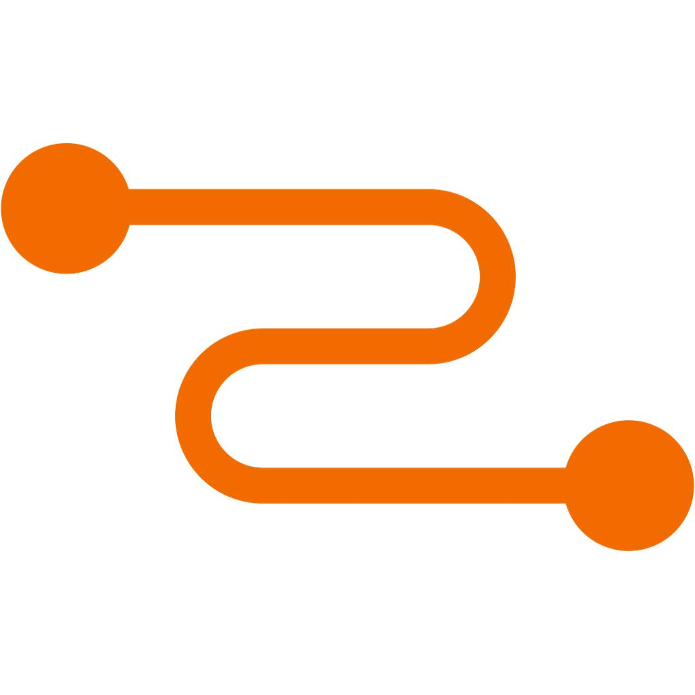

<p align="center">
  
</p>

<h1 align="center">DS-mon</h1>

<p align="center">
  macOS 菜单栏 DeepSeek API 余额实时监控工具
  <br/>
  <sub>Swift 6 + SwiftUI + AppKit | macOS 15 Sequoia+ | Apple Silicon</sub>
</p>

<p align="center">
  
  
  
  
</p>

## 功能

- **菜单栏余额监控** — 在菜单栏实时显示 DeepSeek 账户余额，一目了然
- **余额过低预警** — 可自定义预警阈值，余额低于阈值时红色闪烁提醒
- **自动刷新** — 每 60 秒自动拉取最新余额和可用模型列表
- **Keychain 安全存储** — API Key 通过系统钥匙串加密存储，不落盘明文
- **优雅的弹出面板** — 点击菜单栏图标查看余额、模型、状态详情
- **直观的错误提示** — 细分 API Key 无效、网络超时、服务器错误等场景

## 截图

| 弹出面板 | 设置窗口 |
|:---:|:---:|
|  |  |

## 前置条件

- macOS 15 Sequoia 或更高版本
- Apple Silicon Mac（M1/M2/M3/M4）
- DeepSeek API Key（[deepseek.com](https://platform.deepseek.com/api_keys)）

## 安装

### 方式一：下载预编译包

从 [Releases](https://github.com/Cherno76/DS-mon/releases) 下载最新版 `DS-mon.app.zip`，解压后：

1. 将 `DS-mon.app` 拖入 `应用程序` 文件夹
2. **右键 → 打开**（首次运行需绕过 Gatekeeper）
3. 点击菜单栏图标 → 设置 → 输入 API Key → 保存

### 方式二：从源码构建

```bash
git clone https://github.com/Cherno76/DS-mon.git
cd DS-mon
swift build -c release --disable-sandbox
open .build/release/DS-mon
```

## 使用方法

1. 启动后菜单栏出现 Logo 图标和余额 `¥0.00`
2. 点击菜单栏图标打开弹出面板
3. 点击「设置」打开配置窗口
4. 输入 DeepSeek API Key，点击「保存 Key」
5. 钥匙串弹窗 → 点击 **「始终允许」**
6. 余额自动刷新显示，之后每 60 秒自动更新

### 状态指示

| 状态 | 菜单栏 | 面板徽章 |
|------|--------|---------|
| 余额充足（≥阈值） | 默认颜色 | 🟢 正常 |
| 余额低于阈值 | 🔴 红色闪烁 | 🔴 红色闪烁 |
| 网络错误 / Key 无效 | 灰色 | 🟠 异常 |

## 配置

| 配置项 | 说明 | 默认值 |
|--------|------|--------|
| 余额预警阈值 | 低于此值时红色闪烁 | ¥20 |
| API Key | DeepSeek 平台 API 密钥 | — |
| 自动刷新间隔 | 余额自动拉取周期 | 60 秒 |

## 项目结构

```
DS-mon/
├── Sources/
│   └── DS-mon/
│       ├── DSmonApp.swift        # 应用入口 + 状态栏控制器 + 弹出面板 UI
│       ├── DeepSeekStats.swift    # 数据模型 + 网络请求 + Keychain 管理
│       ├── ThresholdView.swift   # 设置窗口 UI
│       ├── dslogo.png            # 菜单栏图标（鲸鱼 + 放大镜）
│       ├── dslogo1.png           # 应用图标（鲸鱼 + 数据图表）
│       └── Assets.xcassets/      # Xcode 资源目录
├── build/
│   └── DS-mon.app/               # 预编译应用包
├── Package.swift                 # SPM 构建配置
└── .gitignore
```

## 技术栈

- **Swift 6** — 使用 `@Observable` 宏、`@MainActor` 严格并发
- **SwiftUI** — 弹出面板和设置窗口 UI
- **AppKit** — 状态栏组件（`NSStatusBar`）、弹出面板（`NSPopover`）
- **Security.framework** — Keychain 原生 API 安全存储
- **SPM** — Swift Package Manager 构建管理

## 构建 Release

```bash
swift build -c release --disable-sandbox

# 手动打包 .app（若自动打包未运行）
mkdir -p build/DS-mon.app/Contents/{MacOS,Resources}
cp .build/release/DS-mon build/DS-mon.app/Contents/MacOS/
cp -R .build/release/DS-mon_DS-mon.bundle build/DS-mon.app/Contents/Resources/
cp Info.plist build/DS-mon.app/Contents/
codesign --force --deep --sign - build/DS-mon.app
open build/DS-mon.app
```

## 许可证

MIT License © 2026 Cherno76